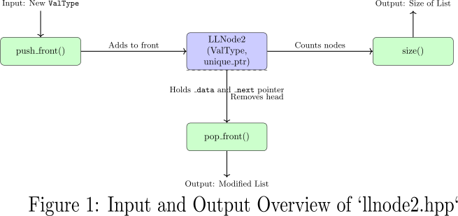
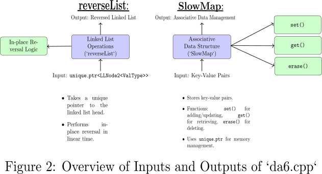

# Linked List and Associative Data Structures Using Smart Pointers in C++

## Introduction

The program `da6.hpp` is designed to demonstrate two key functionalities: efficient reversal of a linked list using smart pointers and the implementation of a template class for managing associative data sets. The linked list reversal is performed without using any manual memory management (`new` or `delete`), utilizing C++'s Standard Template Library (STL) smart pointers for safer memory handling. The associative data container, `SlowMap`, offers a way to store key-value pairs, leveraging unique pointers for efficient resource management and encapsulating the linked list nodes as the underlying data structure.

---

## Program Architecture

### Header Files and Structures

#### `llnode2.hpp` Overview
- **Purpose**: Defines the structure of the singly linked list node (`LLNode2`) and associated functionalities.
- **Key Elements**:
  - The struct `LLNode2<ValType>` defines a node containing a value and a unique pointer to the next node.
  - Helper functions like `size()`, `push_front()`, and `pop_front()` provide linked list operations like counting nodes, adding to the front, and removing nodes.

	

#### `da6.hpp` Overview
- **Purpose**: Implements two main features: reversing a linked list and creating an associative data container called `SlowMap`.
- **Key Elements**:
  - **`reverseList()` Function**: Reverses a linked list in linear time, maintaining the in-place nature without value copying.
  - **`SlowMap<KeyType, DataType>` Class**: Implements an associative data container using a singly linked list structure (`LLNode`) with key-value pairs.
	- Operations like `set()`, `get()`, `erase()`, `present()`, and `size()` provide functionality to manipulate and traverse the key-value data set.

	

---

### Detailed Class and Function Descriptions

#### `reverseList()` Function
- **Objective**: Efficiently reverse a singly linked list represented by a `unique_ptr`.
- **Implementation**: Uses three pointers (`prev`, `next`, and `curr`) to traverse and reverse the list in linear time.
- **Highlights**:
  - In-place reversal without copying values.
  - Utilizes `std::move` for transferring ownership between `unique_ptr`s.

#### `SlowMap` Class Template
- **Objective**: Store associative data as key-value pairs using a linked list.
- **Key Methods**:
  - **`set()`**: Inserts or updates key-value pairs.
  - **`get()`**: Retrieves the value associated with a key; throws an exception if the key is not found.
  - **`erase()`**: Removes a key-value pair from the linked list.
  - **`present()`**: Checks if a key exists in the container.
  - **`size()`**: Counts the number of key-value pairs stored.
- **Exception Handling**: Uses `std::out_of_range` for errors when keys are not found.
- **Use of Smart Pointers**: `std::unique_ptr` is employed to manage list nodes, ensuring proper memory management and avoiding manual `delete` operations.

---

## Examples and Use Cases

### Reversing a Linked List
The `reverseList()` function demonstrates reversing a linked list of any type efficiently. For example, given a list of integers `1 -> 2 -> 3`, the function will transform it to `3 -> 2 -> 1`.

### Using `SlowMap` for Key-Value Storage
The `SlowMap` template can store any type of key-value pairs. For instance, using `SlowMap<int, std::string>`, the following operations are possible:
- **Inserting Data**: `m.set(100, "abc")` adds a key-value pair to the map.
- **Retrieving Data**: `m.get(100)` fetches the value `"abc"` associated with key `100`.
- **Checking Existence**: `m.present(100)` returns `true` if the key `100` exists in the map.
- **Deleting Data**: `m.erase(100)` removes the key-value pair associated with `100`.

---

## Design Decisions and Benefits

- **Use of Smart Pointers (`std::unique_ptr`)**: The decision to use `unique_ptr` ensures automatic and safe memory management, reducing memory leaks and dangling pointers.
- **Exception-Safe Code**: The program adheres to exception safety, using standard exceptions (`std::out_of_range`) for error handling in `SlowMap`.
- **Encapsulation and Templating**: By using templates, the `SlowMap` and linked list functions are generalized to work with any data type, enhancing code reusability.

---

## Testing and Examples in `da6_main.cpp`

The `da6_main.cpp` file contains an alternate main function that tests various operations of `SlowMap`:
- Checks if the map is empty or not.
- Tests the insertion, retrieval, and deletion of key-value pairs.
- Validates exception handling when trying to access a non-existent key.

---

## Conclusion and Acknowledgements

The program showcases efficient use of linked lists and associative data structures in C++, demonstrating best practices for memory management with smart pointers. The `reverseList` function exemplifies in-place list manipulation, while `SlowMap` provides a basic yet flexible key-value store leveraging unique pointers.

Thanks to those that peer reviewed this document. And acknowledgement to ChatGPT for assisting with some adaptations to my .svg images.